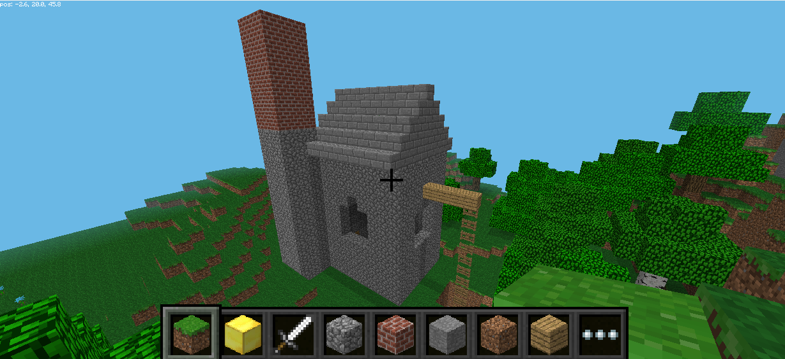

# Cornish_Engine_House_with_Minecraft

      

This is used at Software Cornwall Tech Jams. It creates a Cornish Engine house that can be seen all over the county but in Minecraft. Complete with the mine too.

The idea of the instructons is to build up the code with achievable sections a bit at a time. If the exercise is finished, great, but along the way are milestones to success.

The exercise is designed to be used on a Raspberry Pi. These have all the required software installed as part of the standard operating system so there are no install instructions here.
